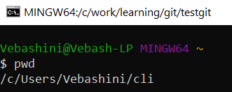
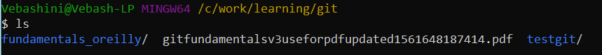
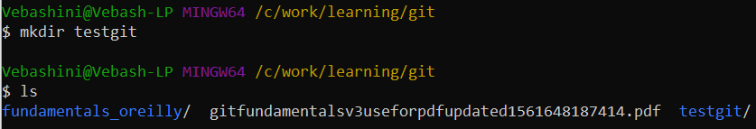
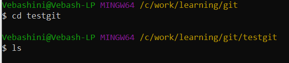
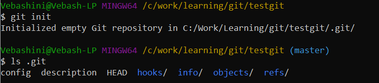
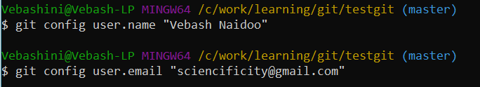
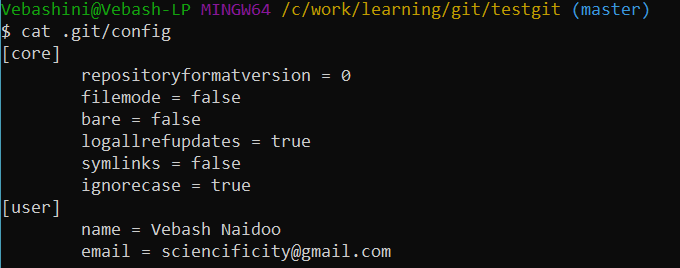

```{r setup, include=FALSE}
options(htmltools.dir.version = FALSE)
# run xaringan::inf_mr() to interactively show slides changing on right
```

# Keep in touch

[`r icon::fa("twitter")` @Vebash](http://twitter.com/vebash)  
[`r icon::fa("github")` @sciencificity](http://github.com/sciencificity)  
[`r icon::fa("paper-plane")` vebashini@gmail.com](mailto:vebashini@gmail.com)

---


<div style = "width: image width px; font-size: 100%; text-align:center;">
Our package will be functional but not necessarily pretty.
</div>


---
class: inverse, center, middle

# Get Started

---

# What's a package anyway?

Packages are units of reproducible R code. 

A package includes:
- R functions
- Documentation describing how to use the functions
- Data

---


- Create a new R Project from the menu 

`File -> New Project -> New Directory -> R Package`

--

- 

--

- 


---

# Git - Some tips & Useful commands

## Using Git Bash
- `pwd`: Tells you where you are currently, literally print working directory.


- `ls`: Gives you a list of files and folders in your current working directory.


- `mkdir name_of_folder`: Makes a new directory called **name_of_folder** in the current working directory.


---
# Git - Some tips & Useful commands continued ...
- `cd name_of_folder`: Places you in the **name_of_folder** directory.


- `git init`: Initialises a git repo in the directory you run the command from. You should now see a .git folder if you run `ls` after the initialisation.


- `git config user.name "Firstname Surname"` AND `git config user.email "test@testexample.com"`: Adds the user name and email address to the config file.


---
# Git - Some tips & Useful commands continued ...
- `cat .git/config`: Displays the contents of the config file.


---

class: center, middle

# Thanks!

Slides created via the R package [**xaringan**](https://github.com/yihui/xaringan).

